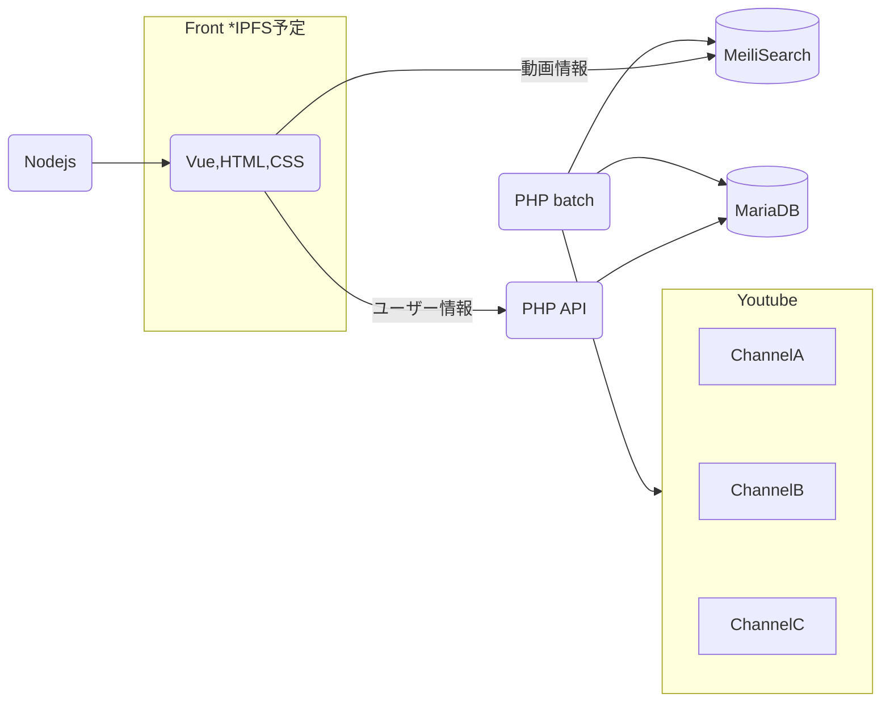

# Youtube クリップ （サーバーサイド）

## 概要

特定のYoutubeチャンネルの動画情報を収集し、
Meilisearchで全文検索を行えるようにするAPI。  
フロントは別途構築予定。

## 特徴
- コマンド一つでYoutubeの特定チャンネルの全動画情報を収集
- 1日おきに最新動画をチェックしアップデート

## 開発環境
- Docker Desktop 4.12.0
- Ubuntu 22.04.3 LTS（Windows 11 WSL上）
- PHP 8.3.2
    - Laravel 10.43.0
- Meilisearch 1.6.0

## システム構成  



＞＞[データベース構成図](./docs/databse.md)

## 使い方
### 前準備
- GoogleでYoutube APIの利用登録を行う
- PHP, MariaDB, Meilisearch, git, crontabがある環境を用意する

### インストール
1. 本リポジトリをダウンロード
2. .env.exampleをコピーして.envを作成、下記の値を設定する  
    ```
    APP_KEY
    
    DB_HOST
    DB_DATABASE
    DB_USERNAME
    DB_PASSWORD

    YOUTUBE_API_KEY
    MEILI_HTTP_ADDR
    MEILI_MASTER_KEY
    MEILI_INDEX_NAME
    ```
3. 下記コマンドを実行してPHPモジュールとデータベースをセットアップする
    ```
    composer install
    php artisan migrate
    ```
4. contabに下記のコマンド定期実行を設定する
    ```
    * * * * * php <プロジェクトディレクトリ>/artisan schedule:run 1>> /dev/null 2>&1
    ```


### 操作
まず対象とするYoutubeチャンネルのID（UCxxxxxxxxxxxxの文字列）を用意してください。  
次にCLIで右記のコマンドを実行します。
    ```
     php artisan batch:add-cahnnel
    ```
対話形式の中で用意したIDを入力すると、対象のチャンネルの全動画情報が保存されます。  
保存した情報はMeiliSearch（http://localhost:7700など）で確認できます。


## ライセンス

このプロジェクトは[MITライセンス](LICENSE)の下でライセンスされています。

