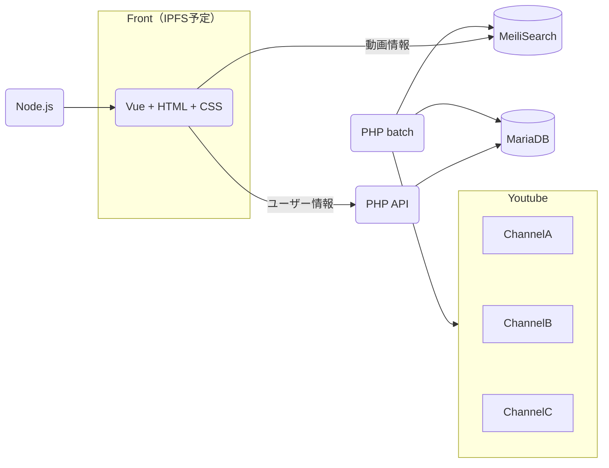

# Youtube クリップ （サーバーサイド）

## 概要

特定のYoutubeチャンネルの動画情報を収集し、
本家よりも検索しやすサイトを構築する。  
こちらは動画情報収集用リポジトリ

## 特徴

## 開発環境
- Docker Desktop 4.12.0
- Ubuntu 22.04.3 LTS（Windows 11 WSL上）
- PHP 8.3.2
    - Laravel 10.43.0
- Meilisearch 1.6.0

開発環境構築用のリポジトリを公開予定。

## システム構成  

##　今後の大まかな予定
- batch開発
- MariaDB設計
- API開発
- フロント（Vue）開発

## ライセンス

このプロジェクトは[MITライセンス](LICENSE)の下でライセンスされています。

