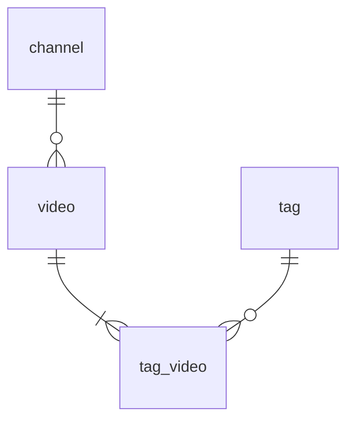

# データベース構成
## ER図

## テーブル定義書

### テーブル名: channels

| 列名       | データ型     | 制約           | 説明         |
|------------|--------------|----------------|--------------|
| id         | INT          | PK             | チャンネルID   |
| youtube_id | VARCHAR(255) | UK, NOT NULL | youtube上のID  |
| title      | VARCHAR(255) | NOT NULL       | チャンネル名   |
| new_stocked_at | timestamp | DEFAULT NULL  | 最新の動画公開日時（videos連動） |
| created_at | timestamp    | DEFAULT current_timestamp   | 作成日時     |
| updated_at | timestamp    | DEFAULT NULL   | 更新日時     |
| deleted_at | timestamp    | DEFAULT NULL   | 削除日時     |

### テーブル名: videos

| 列名       | データ型     | 制約           | 説明         |
|------------|--------------|----------------|--------------|
| id         | INT          | PK             | 動画ID       |
| channel_id | INT          | FK,NOT NULL    | チャンネルID |
| youtube_id | VARCHAR(255) | UK, NOT NULL   | youtube上のID   |
| etag       | VARCHAR(255) | UK, NOT NULL   | ETag         |
| title      | VARCHAR(255) | NOT NULL       | 動画タイトル |
| description| text         |                | 動画説明文   | 
| duration    | INT          | NOT NULL       | 動画秒数     |
| published_at| timestamp   | NOT NULL       | 動画公開日   |
| created_at | timestamp    | DEFAULT current_timestamp   | 作成日時     |
| updated_at | timestamp    | DEFAULT NULL   | 更新日時     |
| deleted_at | timestamp    | DEFAULT NULL   | 削除日時     |

### テーブル名: tags

| 列名       | データ型     | 制約           | 説明         |
|------------|--------------|----------------|--------------|
| id         | INT          | PK             | タグID       |
| name       | VARCHAR(255) | UK, NOT NULL   | タグ名       |
| created_at | DATETIME     | DEFAULT current_timestamp   | 作成日時     |

### テーブル名: tag_video

| 列名       | データ型     | 制約           | 説明         |
|------------|--------------|----------------|--------------|
| tag_id    | INT          | FK             | タグID       |
| video_id     | INT          | FK             | 動画ID       |

